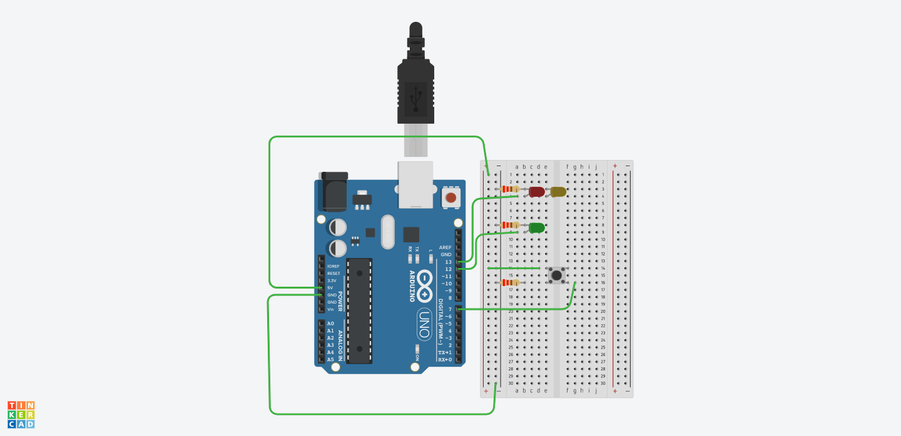

# Arduino Peer-to-Peer Learning Bootcamp

Welcome to the Arduino Peer-to-Peer Learning Bootcamp! This collaborative project aims to help beginners learn and explore the exciting world of Arduino microcontrollers. Our first project focuses on using Arduino and a switch to control LED lights.

## Project Description

The goal of this project is to create a simple circuit using an Arduino board and a switch to turn on and off LED lights. Through this hands-on project, participants will gain essential knowledge of Arduino programming, basic electronics, and circuit design. We encourage everyone to actively participate, share ideas, and learn together as a community.

## Table of Contents

- [Getting Started](#getting-started)
    - [Prerequisites](#prerequisites)
    - [Hardware Requirements](#hardware-requirements)
    - [Circuit Diagram](#circuit-diagram)
- [Contributing](#contributing)
- [License](#license)

## Getting Started

### Prerequisites

Before you start this project, make sure you have a basic understanding of programming concepts and electronics. No prior Arduino experience is required, but some familiarity with C/C++ will be beneficial.

### Hardware Requirements

To complete this project, you will need the following components:

- Arduino board (e.g., Arduino Uno, Arduino Nano)
- A momentary push-button switch
- LEDs (choose any color you like)
- 220 Ohm resistors
- Connecting cables

### Circuit Diagram

## Contributing

We welcome contributions from all participants! If you have any ideas, improvements, or bug fixes, please feel free to submit a pull request. For major changes, please open an issue first to discuss the changes with us.

## License

This project is licensed under the [MIT License](LICENSE).

## Links to simulations

- [ex00](https://www.tinkercad.com/things/h2ogVpNzkKm)
- [ex00_bonus](https://wokwi.com/projects/371570790069649409)
- [ex01](https://wokwi.com/projects/371972296246360065)
- [ex02](https://www.tinkercad.com/things/0au9rPEr4JM)